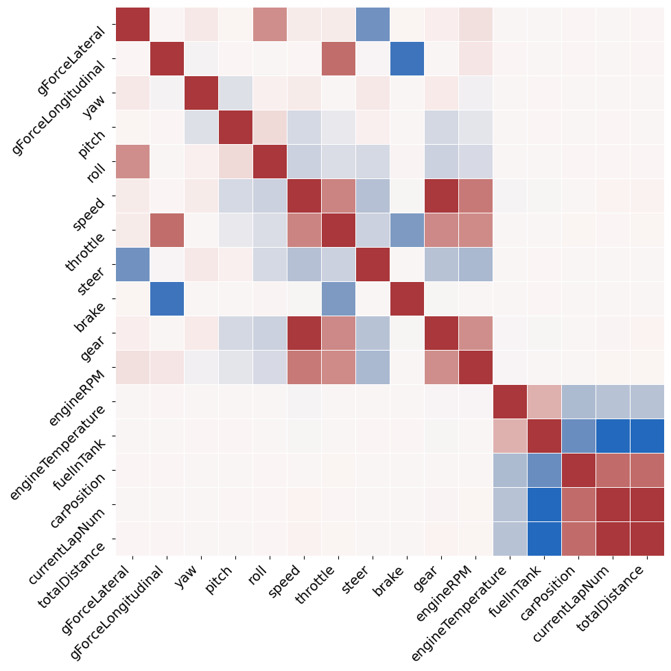
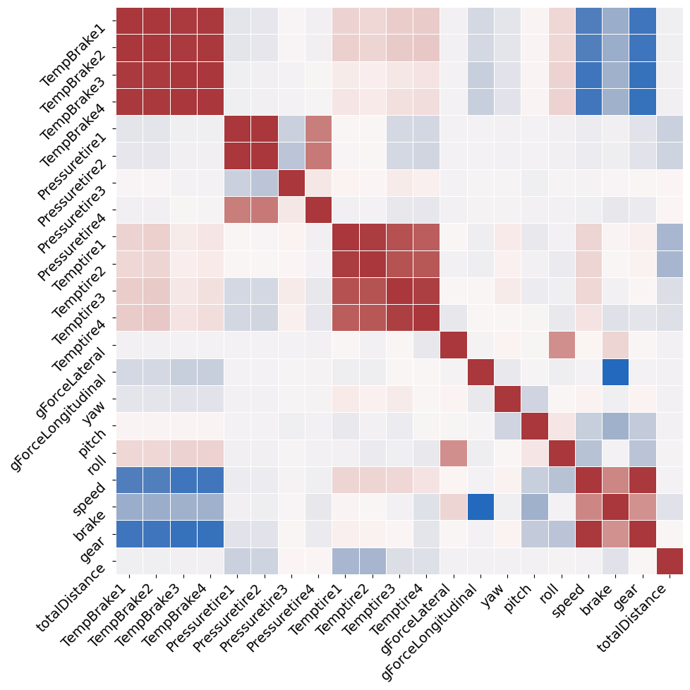
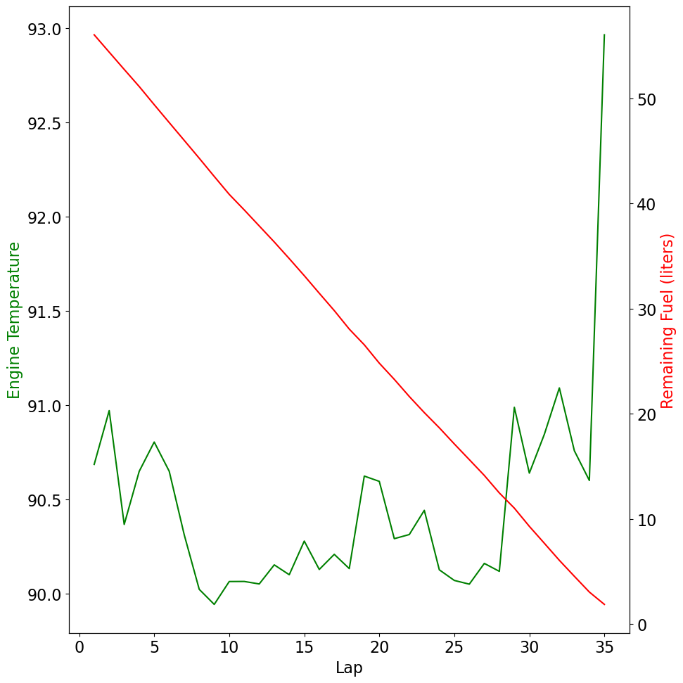
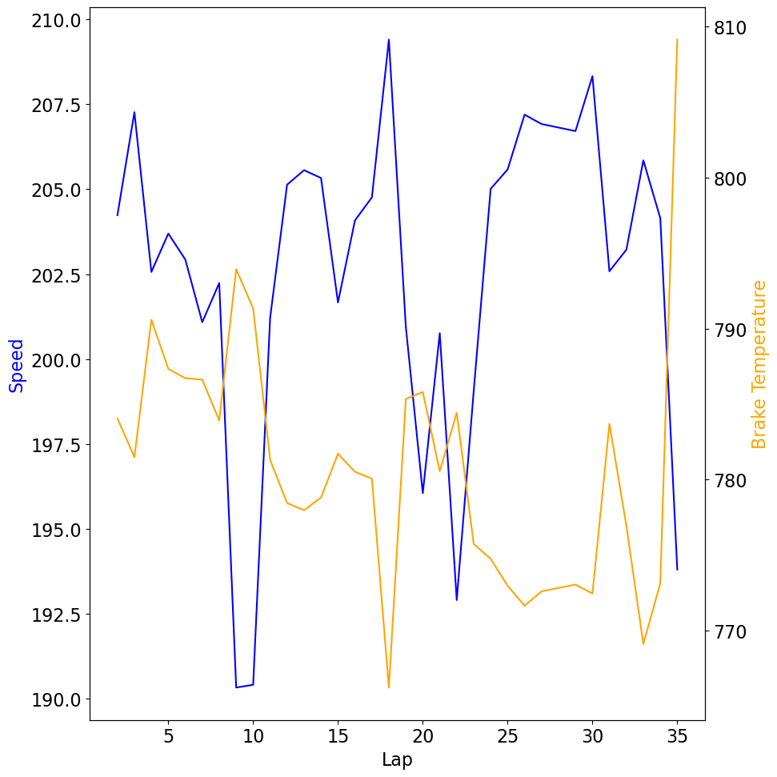
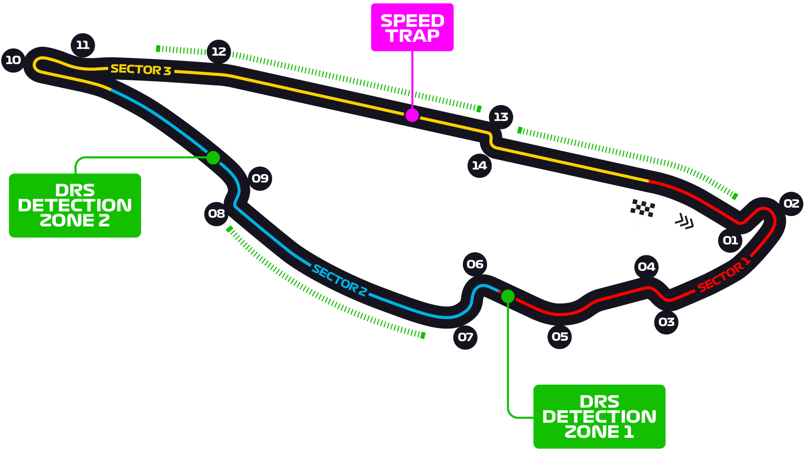
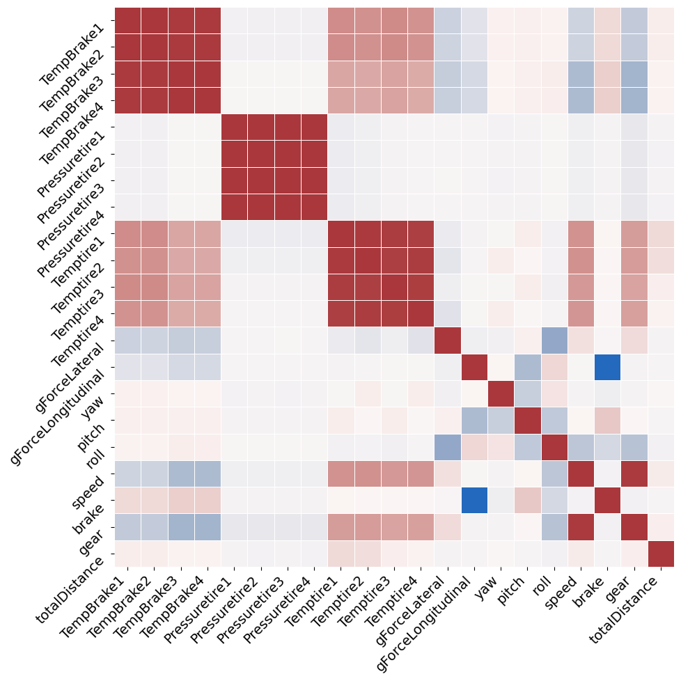
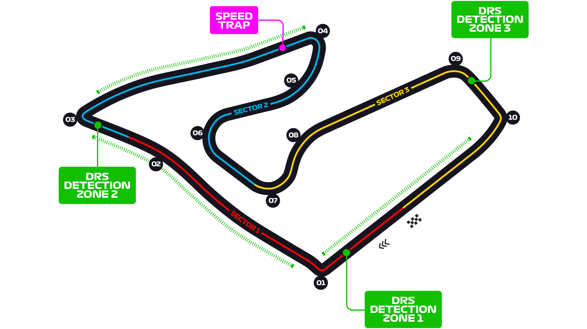
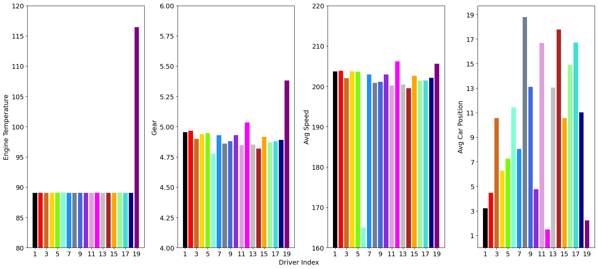

# Simulated F1 Racecar Telemetry EDA

## Table of Contents
1. [Overview](#overview)
2. [Telemetry](#telemetry)
3. [Dataset](#dataset)
4. [Curation](#curation)
5. [Questions](#questions)
6. [Visualization](#visualization)
7. [Conclusion](#conclusion)

## **Overview**
The following EDA aims to use python data analysis libraries to determine correlations between telemetry subsystems in simulated F1 race vehicles. I'll also explore race outcomes that can be derived purely from telemetered data. For this analysis I'll be using simulated telemetry from F1 2020.

## **Telemetry**
Telemetry can be described as the measurement and transmission of instrument readings.  Example: Engine temperature readings being wirelessly transmitted to the pit crew. These readings help to determine the status and health of various subsystems and assist in operation and maintenance of the overall system.

## **Dataset**
The dataset used for this EDA was pulled from kaggle : https://www.kaggle.com/datasets/coni57/f1-2020-race-data?select=TelemetryData_10230136787177318441.csv.
The data includes telemetry from 20 drivers across 22 simulated races.  The data frame for each race contains over 1,250,000 records for 56 telemetry categories. For this EDA, I'll primarily use the data frame from a single race.

## **Curation**
For manipulation of these massive datasets, I created a script (csv_to_db.py) for pulling each individual file into a postgres database. I used cloudBeaver to view the data types for each category and get an idea of the data I wanted to pull for my analysis.  

For comparing information from an individual driver across multiple races, I wrote several .sql files for querying my database for a single driver and saving that query as an excel file that can be pulled into a pandas dataframe.

For instances where a driver did not finish a race, the telemetry recorded a 0 for reading such as speed. I converted these to NaN to eliminate their consideration when averaging values for drivers across all categories.

Lastly, several columns contained a string of multiple readings (i.e. tire temps listed as '30/30/30/30' in a single column). I separated the string using .split and converted to numeric using .to_numeric to easy ingest into .corr().

## **Questions**
Which sub-systems are correlated?
Can individual driver telemetry vs all driver avg,max,min indicate system issues?
Can finishing position be correlated with any specific telemetry subsystem?

## **Visualization**
###Which sub-systems are correlated?

As can probably be expected, systems like brake/throttle are highly correlated with g force. Speed and avg gear are highly correlated.

All tire and brake temps also nicely corrlate with each other.

Some unusual correlations include temperature and remaining fuel, brake temp and speed,and a non-uniform correlation among tire pressure where all other tire attributes are uniform.

The engine temp and fuel correlation does not appear to exist when viewing the line plot.  

Brake temp and speed have a nice inverse corr.

The non-uniform tire pressure appears to be an artifact of track shape.  With this particular track having more extreme speeds and stops.

 

 

### Can individual driver telemetry vs all driver avg,max,min indicate system issues?

Yes!  Average individual driver stats compared  against each other can reveal small offsets.

### Can finishing position be correlated with any specific telemetry subsystem?

Looking at the previous bar charts, car position seems to be durectly linked to average speed.  

## **Conclusion**

Which vehicle subsystems are correlated?
	Usual suspects – gforce:throttle/brake, speed:gear, tire temps
	Unsual – Non-uniform tire pressure, engine temp: remaining fuel  

Can vehicle telemetry indicate small tuning/performance issues?
	Yes, when driver stats are compared against other driver avg/min/max

Which telemetry characteristics are indicative of higher place finishes? 
	Average speed is the greatest indicator of car position. Higher gear 		averages and less brake use are indicators of higher average speed.