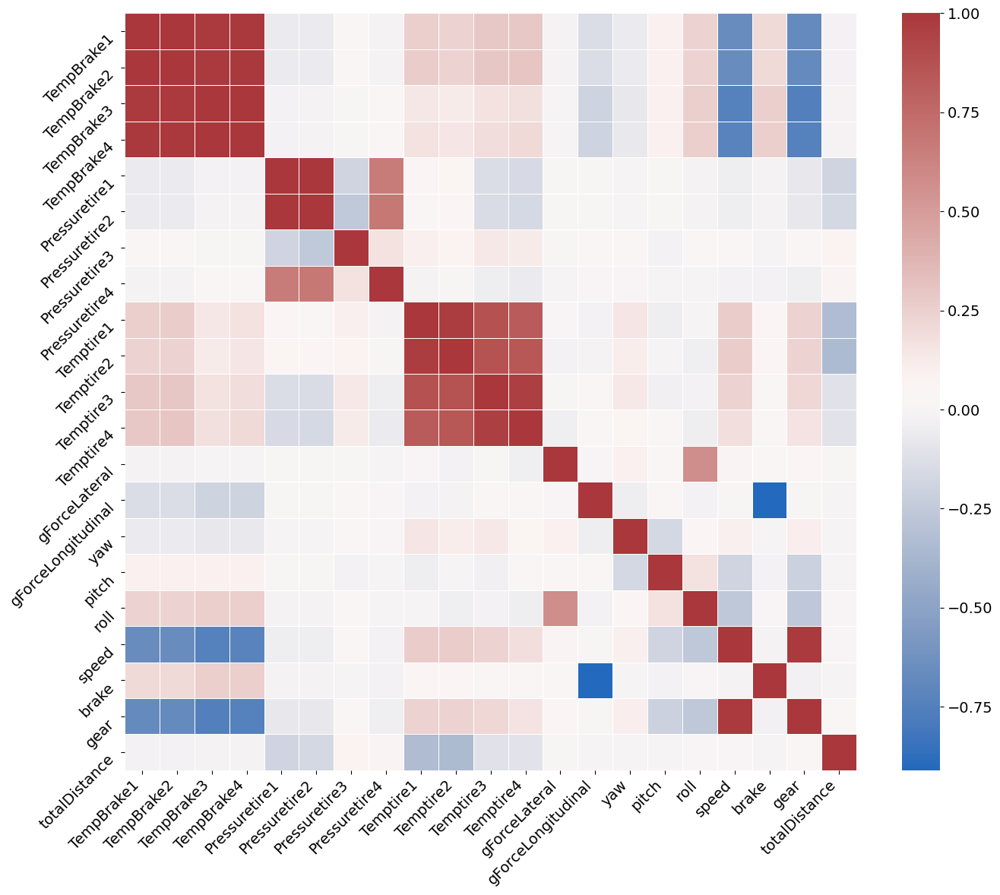

# Simulated F1 Racecar Telemetry EDA

## Table of Contents
1. [Overview](#overview)
2. [Telemetry](#telemetry)
3. [Dataset](#dataset)
4. [Curation](#curation)
5. [Questions](#questions)
6. [Visualization](#visualization)
7. [Conclusion](#conclusion)

## **Overview**
The following EDA aims to use python data analysis libraries to determine correlations between telemetry subsystems in simulated F1 race vehicles. I'll also explore race outcomes that can be derived purely from telemetered data. For this analysis I'll be using simulated telemetry from F1 2020.

## **Telemetry**
Telemetry can be described as the measurement and transmission of instrument readings.  Example: Engine temperature readings being wirelessly transmitted to the pit crew. These readings help to determine the status and health of various subsystems and assist in operation and maintenance of the overall system.

## **Dataset**
The dataset used for this EDA was pulled from kaggle : https://www.kaggle.com/datasets/coni57/f1-2020-race-data?select=TelemetryData_10230136787177318441.csv.
The data includes telemetry from 20 drivers across 22 simulated races.  The data frame for each race contains over 1,250,000 records for 56 telemetry categories. For this EDA, I'll primarily use the data frame from a single race.

## **Curation**
For manipulation of these massive datasets, I created a script (csv_to_db.py) for pulling each individual file into a postgres database. I used cloudBeaver to view the data types for each category and get an idea of the data I wanted to pull for my analysis.  

For comparing information from an individual driver across multiple races, I wrote several .sql files for querying my database for a single driver and saving that query as an excel file that can be pulled into a pandas dataframe.

For instances where a driver did not finish a race, the telemetry recorded a 0 for reading such as speed. I converted these to NaN to eliminated their consideration when averaging values for drivers across all categories.

Lastly, several columns contained a string of multiple readings (i.e. tire temps listed as '30/30/30/30' in a single column). I separated the string using .split and converted to numeric using .to_numeric to easy ingest into .corr().

## **Questions**
Which sub-systems are correlated?
Can individual driver telemetry vs all driver avg,max,min indicate system issues?
Can finishing position be correlated with any specific telemetry subsystem?

## **Visualization**
Which sub-systems are correlated?

Can individual driver telemetry vs all driver avg,max,min indicate system issues?

Can finishing position be correlated with any specific telemetry subsystem?

## **Conclusion**
